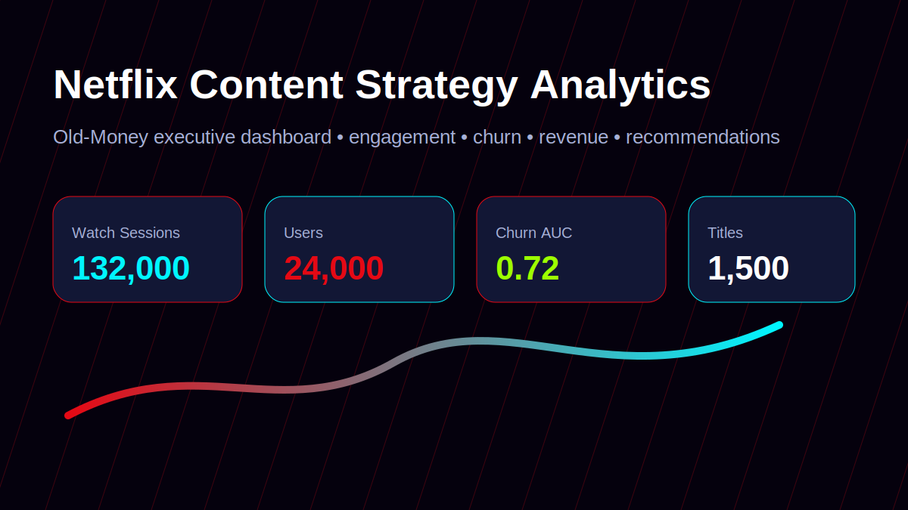
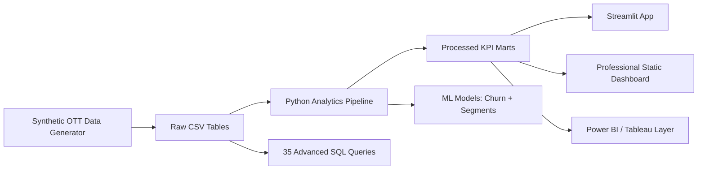

# Netflix Content Strategy & Viewer Engagement Analytics Dashboard



> Premium OTT analytics platform for content strategy, viewer engagement, churn risk, subscription revenue, recommendations, and executive streaming intelligence.

## Hero Section

**Streaming Intelligence for Content, Retention, and Revenue Teams** — a recruiter-ready product analytics case study that converts watch sessions, reviews, content metadata, user profiles, and subscription data into executive KPIs and strategic decisions.

## Project Overview

A production-style, professional Netflix-inspired analytics platform for OTT strategy teams. The project analyzes viewer behavior, content performance, churn risk, subscription revenue, recommendation opportunities, and global engagement trends using Python, SQL, Streamlit, BI-ready DAX, and machine learning.

## Business Problem

Streaming platforms need to decide which content to promote, renew, localize, or retire while reducing churn and growing premium subscriptions. This project answers:

- Which genres and titles create the strongest engagement?
- Which viewers are likely to churn?
- Which users are good premium-upgrade candidates?
- Which countries and devices drive watch-time growth?
- How should content strategy react to completion, review, and binge behavior?

## Architecture



## Dataset

| Table | Rows | Description |
|---|---:|---|
| Users | 24,000 | Age, country, subscription type, signup date, watch hours, churn status |
| Watch History | 132,000 | Session-level watch time, completion, device, duration |
| Content Library | 1,500 | Movies/TV shows, genre, release year, IMDB rating, duration, language |
| Subscription Plans | 4 | Basic, Standard, Premium, Mobile plans and monthly pricing |
| Reviews | 52,000 | Ratings, review text, sentiment-ready labels |
| Devices | 29,811 | User-device usage layer |

## KPI Highlights

- **Watch Sessions:** 132,000
- **Total Watch Hours:** 142,055
- **Average Completion Rate:** 69.3%
- **Churn Rate:** 19.9%
- **Revenue Proxy:** $0.06M
- **Premium Adoption:** 26.5%
- **Churn Model ROC-AUC:** 0.72

## Dashboard Pages

1. **Executive Overview** — top KPIs, monthly watch-time, revenue mix
2. **Viewer Analytics** — viewer segments, engagement clusters, country behavior
3. **Content Performance** — top titles, genre performance, completion analysis
4. **Revenue Analytics** — plan revenue, RPU, premium adoption
5. **Churn Analysis** — churn by plan and low-engagement risk indicators
6. **Global Engagement Insights** — country and language preferences

## Advanced Analytics

- **Churn Prediction:** Random Forest model using engagement, completion, device, revenue, age, and plan features.
- **Viewer Segmentation:** K-Means clusters mapped to interpretable strategy groups.
- **Recommendation Preview:** segment-to-content recommendations based on genre affinity and content quality.
- **Sentiment Analysis:** review labels derived from rating/review behavior for BI integration.
- **Watch-Time Forecasting:** monthly watch-hour trend forecast for capacity and content planning.
- **Genre Popularity Forecasting Input:** SQL and marts support genre-level forecasting.

## SQL Coverage

`sql/advanced_analytics_queries.sql` includes 35 queries covering:

- retention cohorts
- DAU and monthly watch trends
- genre popularity
- content engagement scoring
- churn analysis
- binge-watching behavior
- subscription upgrade candidates
- original vs licensed performance
- high-quality low-discovery content
- recommendation co-watch pairs

## Streamlit App

```bash
pip install -r requirements.txt
streamlit run streamlit_app/app.py
```

## Screenshots


Additional screenshot slots for deployment polish:

- `visuals/dashboard_overview.svg`
- `dashboard/executive_dashboard.html`
- `public/index.html`

## Installation Guide

```bash
python -m venv .venv
source .venv/bin/activate
pip install -r requirements.txt
streamlit run streamlit_app/app.py
```

## Deployment Guide

The public-ready professional dashboard is built into `public/index.html` and can be deployed as a static Vercel site.

```bash
python src/build_static_dashboard.py
npx vercel --prod
```

## Performance Notes

- Static dashboard is prebuilt into `public/index.html` for low-latency recruiter viewing.
- Streamlit app remains available for deeper interactive exploration.
- Processed marts separate heavy data generation from presentation for maintainability.
- Vercel deployment avoids runtime Python dependency for the public dashboard.

## Static Dashboard / Vercel

The public-ready professional dashboard is built into `public/index.html`.

```bash
python src/build_static_dashboard.py
npx vercel --prod
```

## Power BI / Tableau

- Use `data/raw/*.csv` as source tables.
- Use `data/processed/*.csv` for KPI-ready marts.
- DAX measures are available in `powerbi/measures.dax`.
- Suggested relationships:
  - `Users[User_ID]` → `Watch_History[User_ID]`
  - `Content_Library[Content_ID]` → `Watch_History[Content_ID]`
  - `Subscription_Plans[Subscription_Type]` → `Users[Subscription_Type]`

## Business Impact

- Improves content promotion by ranking genres and titles by engagement score.
- Reduces churn by identifying low-engagement viewers before cancellation.
- Supports premium upsell by detecting high-watch Basic/Standard users.
- Helps localization strategy with country-language affinity and global engagement views.
- Enables renewal decisions using completion, watch time, reviews, and retention together.

## Future Improvements

- Add real-time event streaming with Kafka or Pub/Sub.
- Replace synthetic data with anonymized product telemetry.
- Add uplift modeling for retention campaigns.
- Deploy Streamlit on Streamlit Cloud and static executive version on Vercel.
- Add dbt models and CI data tests.

## Repository Structure

```text
netflix-content-engagement-analytics/
├── data/raw/                  # source-like synthetic OTT tables
├── data/processed/            # KPI marts, segments, forecasts, sentiment
├── notebooks/                 # EDA workflow notebook
├── sql/                       # 35 advanced SQL queries
├── dashboard/                 # executive static dashboard
├── streamlit_app/             # interactive Streamlit BI app
├── reports/                   # strategic insights
├── visuals/                   # professional dashboard preview
├── models/                    # ML models and recommendation seed
├── src/                       # data and dashboard generation scripts
├── public/                    # Vercel static output
├── powerbi/                   # BI measures
├── README.md
├── requirements.txt
└── .gitignore
```

---

## Resume Value

Demonstrates end-to-end analytics engineering across synthetic data generation, KPI modeling, advanced SQL, segmentation, churn prediction, recommendation logic, BI design, and static deployment for Product Analyst, Data Analyst, BI Analyst, and Analytics Engineering interviews.

Built as a portfolio-grade streaming analytics case study for Product Analyst, Data Analyst, BI Analyst, and Analytics Engineering interviews.
